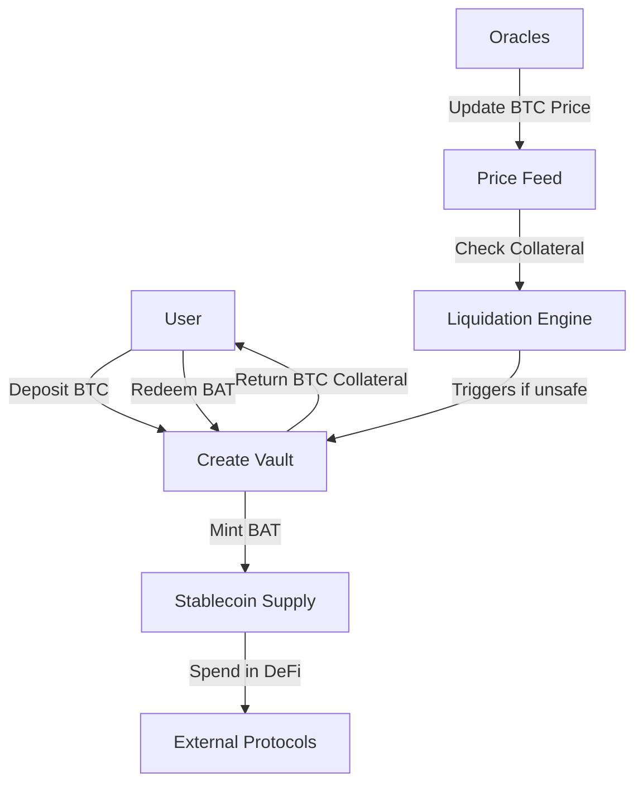

# BitAnchor Protocol

**BitAnchor** is a revolutionary **Bitcoin-collateralized stablecoin infrastructure** built on the **Stacks blockchain**. It enables Bitcoin holders to mint **BitAnchor Tokens (BAT)** — a USD-pegged stablecoin — by locking BTC as collateral in decentralized vaults.

This protocol is designed for Bitcoin maximalists and DeFi users who wish to **unlock liquidity without selling BTC**, combining **trustless collateralization, automated stability mechanisms, and governance-controlled risk parameters**.

---

## 🚀 System Overview

BitAnchor introduces a **decentralized vault-based lending model**:

1. **Collateralization:**
   Users deposit Bitcoin as collateral on Stacks Layer 2, tracked via vaults.

2. **Stablecoin Minting:**
   Users can mint **BAT** (USD-pegged stablecoin) against their collateral, subject to **collateralization ratios**.

3. **Liquidation Engine:**
   If vaults fall below a safety threshold, they can be liquidated by external actors to preserve system stability.

4. **Oracle Integration:**
   Price feeds ensure vault safety by continuously monitoring BTC/USD prices.

5. **Governance:**
   Key risk parameters (e.g., collateralization ratio, fees) are controlled via protocol governance.

---

## 🏗️ Contract Architecture

The protocol is modular, with clearly defined components:

### **Traits**

* Implements **SIP-010 fungible token trait** for stablecoin compliance and interoperability.

### **Core Components**

* **Vaults:**
  Each user’s collateral and stablecoin debt are managed in unique vault structures.

* **Stablecoin Logic:**
  Handles minting, redemption, and supply tracking of BAT.

* **Oracles:**
  Decentralized BTC/USD price feeds ensure reliable collateral valuation.

* **Liquidation System:**
  Allows third parties to liquidate undercollateralized vaults, ensuring solvency.

* **Governance Controls:**
  Contract owner (or DAO in future) can adjust protocol parameters.

---

## 🔄 Data Flow

Below is a simplified flow of core interactions:

---

## 📂 Key Contract Modules

### **1. Vault Management**

* `create-vault(collateral-amount)` → Initializes vault.
* `mint-stablecoin(vault-owner, vault-id, mint-amount)` → Mints BAT against collateral.
* `redeem-stablecoin(vault-owner, vault-id, redeem-amount)` → Burns BAT, releases collateral.

### **2. Risk Management**

* `liquidate-vault(vault-owner, vault-id)` → Third parties liquidate unsafe vaults.

### **3. Oracle System**

* `add-btc-price-oracle(oracle)` → Adds new trusted price feed.
* `update-btc-price(price, timestamp)` → Updates BTC/USD feed.

### **4. Governance**

* `update-collateralization-ratio(new-ratio)` → Updates required collateralization levels.

### **5. Read-Only Helpers**

* `get-latest-btc-price` → Returns latest BTC/USD price.
* `get-vault-details(vault-owner, vault-id)` → Fetch vault state.
* `get-total-supply` → Returns total circulating BAT.

---

## ⚖️ Security Model

* **Overcollateralization:** Minimum ratio enforced to protect solvency.
* **Liquidation Threshold:** Vaults below threshold are eligible for liquidation.
* **Price Boundaries:** BTC prices capped to prevent oracle manipulation.
* **Governance Restrictions:** Only the protocol owner (future DAO) can adjust system parameters.

---

## 📌 Future Improvements

* DAO-controlled governance for decentralization.
* Enhanced oracle redundancy and aggregation.
* Dynamic interest rates and stability fees.
* Cross-chain collateral integrations.

---

## 🛠️ Developer Notes

* Contracts follow **Clarity best practices** with explicit error codes.
* Constants defined for **safety bounds** (BTC price, timestamps).
* Modular design for **upgradeability and governance transition**.

---

## 📜 License

MIT License. Free to use, modify, and extend with attribution.
